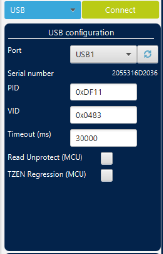
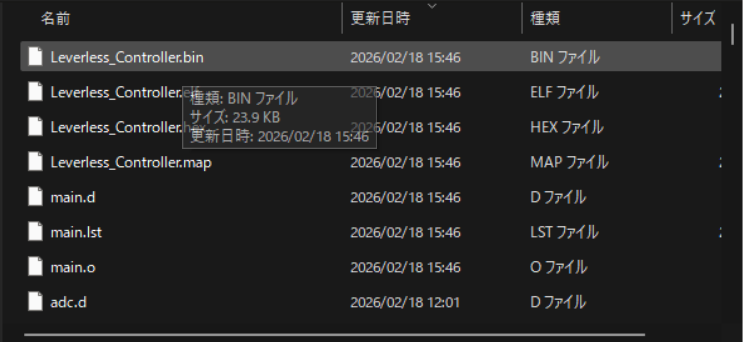
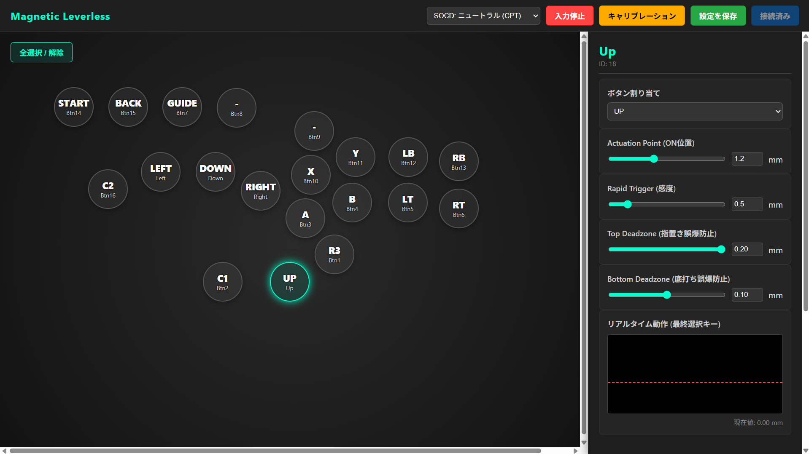
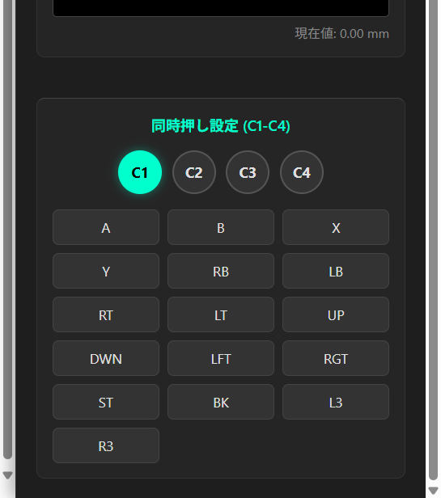

# Magnetic Leverless Controller (自作磁気接点レバーレス)

本プロジェクトは、磁気スイッチ（ホールセンサー）を採用した超低遅延・高機能な競技用レバーレスコントローラーの開発プロジェクトです。

卒業制作の一環として制作されており、進捗に合わせて随時コードやデータの更新を行います。

---

## 概要

従来の物理接点スイッチではなく、磁力による非接触検知を採用することで、物理的な摩耗を抑えつつ、ミリ単位での高度な入力制御を実現しています。

### 主な機能
- **ラピッドトリガー (Rapid Trigger):** 指の上げ下げに即座に反応する超高速入力を実現。
- **可変作動点 (Actuation Point):** 反応する深さを 0.1mm 単位でカスタマイズ可能。
- **Web Configurator:** 専用ソフト不要。ブラウザからリアルタイムに設定変更・モニタリングが可能。
- **SOCDクリーナー:** 競技ルールに準拠した同時押し処理（ニュートラル優先、後押し優先等）を実装。
- **コンボボタン機能:** 1つのボタンで複数のボタン同時押しを再現する補助機能（C1～C4）。
- **入力切断機能:** 設定中の誤入力を防ぐためのセーフティ機能。

---

## ハードウェア設計

設計データはすべて `PCB` フォルダ内に格納されています。

- **基板データ (PCB Design):** 回路図および基板発注用のガーバーデータ。
- **筐体データ (Acrylic Case):** レーザーカット用のアクリルパネル設計データ。

### 主要コンポーネント
- **MCU:** STM32F303CBT6
- **センサー:** GH39F ホールセンサー
- **スイッチ:** - デフォルト: Gateron Magnetic Jade Ultra (3.2mmストローク)
  - 特別仕様: Gateron Magnetic Jade Pro (3.5mmストローク)
- **マルチプレクサ:** ADG708

> [!NOTE]
> 本リポジトリの標準ファームウェアは **3.2mmストローク (Jade Ultra)** に最適化されています。
> 3.5mmストロークのスイッチを使用する場合は、`main.c` 内の `TRAVEL_DISTANCE_MM` を `3.5f` に変更してビルドしてください。

---

## ディレクトリ構成

*(※必要に応じて追記してください)*

---

## 導入手順

### 1. ファームウェアの書き込み
1. [STM32CubeProgrammer](https://www.st.com/ja/development-tools/stm32cubeprog.html) をダウンロードしてPCにインストールします。
2. 基板の裏面にある2つのボタンのうち、**上側のBOOTボタンを押しながら**PCとUSBケーブルで接続します。その後、STM32CubeProgrammerを起動します。
3. 画面右側の接続メニューから「USB」を選択し、「Port」のドロップダウンから適切なポート（例: USB1）を選んだ後、緑色の「Connect」ボタンをクリックして基板と接続します。

4. 接続が成功したら、画面左上の「Open file」タブをクリックします。
5. ファイル選択ダイアログが開くので、ビルド済みの `.bin` ファイル（例: `Leverless_Controller.bin`）を選択して開きます。

6. ファイルを読み込んだ後、「Download」ボタンをクリックしてファームウェアの書き込み（インストール）を実行します。
7. **書き込み完了後、USBケーブルを一度抜き、ボタンを押さずにそのまま再度PCへ接続し直してください。**

### 2. 起動モードの選択
本デバイスには2つの動作モードがあります。

- **ゲームモード (通常起動):**
  そのままUSBを接続します。Windowsから「Xbox 360 Controller」として認識され、すぐにゲームで使用可能です。
- **設定モード (ボタン押下起動):**
  **UPボタン**を押しながらUSBを接続し、**数秒待ってから指を離します**。
  カスタムHIDデバイスとして認識され、ブラウザからの設定が可能になります。

### 3. Web Configurator による設定と使い方
1. **設定モードで起動:** 前述の通り、UPボタンを押しながらデバイスをPCに接続します。
2. 使用しているキースイッチに合わせて、以下のいずれかの設定ページをブラウザ（Chrome/Edge推奨）で開きます。

   - **通常版 (3.2mm / Jade Ultra 等):**
     [https://ltsul4.github.io/hallsenser-leverless-439/WebDriver/WebDriver.html](https://ltsul4.github.io/hallsenser-leverless-439/WebDriver/WebDriver.html)

   - **特別版 (3.5mm / Jade Pro 専用):**
     [https://ltsul4.github.io/hallsenser-leverless-439/WebDriver/WebDriver3.5.html](https://ltsul4.github.io/hallsenser-leverless-439/WebDriver/WebDriver3.5.html)

3. 画面右上の「接続」ボタンを押し、リストから該当する端末を選択して接続します。
   > ⚠️ **注意:** 端末選択画面で「Xbox 360 Controller」等の表示が出る場合は、設定モードでの接続が失敗しています。一度ケーブルを抜き、再度UPボタンを確実に押しながらつなぎ直してください。

4. **各種設定:** 接続が完了すると、専用ドライバー上で以下の設定が可能になります。
   - **キーマッピング:** 各ボタンへの入力割り当てを変更できます。
   - **入力感度の調整:** Actuation Point (AP: 作動点)、Rapid Trigger (RT: 感度)、Top/Bottom Deadzone (DZ: 指置き・底打ち時の誤爆防止) をスライダーで設定できます。
   - **リアルタイム動作:** 右下のグラフで、選択したボタン（画像ではUPボタン）のトラッキング状況をリアルタイムに確認できます。
   - **SOCD設定:** 画面上部のメニューからSOCDクリーナーの方式を選択できます。

5. **同時押し設定 (コンボ機能):** 画面を下にスクロールすると、C1～C4までの4種類の補助ボタンの設定項目があります。ここで複数ボタンの同時押しを登録することができます。
6. **設定の保存:** すべての設定が完了したら、画面右上の緑色の**「設定を保存」**ボタンを押します。
7. **再起動:** 保存完了後、**端末（USBケーブル）を一度抜き、そのまま再度つなぎ直す**ことで、設定がゲームモードに反映されます。

---

## 開発状況

- [x] ホールセンサーによるアナログ値の取得
- [x] ラピッドトリガー・可変作動点アルゴリズムの実装
- [x] WebHID / WebUSB による設定ツールの構築 (`WebDriver.html`)
- [x] Flashメモリへの設定保存機能
- [x] 同時押し（コンボ）ボタン機能の実装
- [x] 入力切断（セーフティ）機能の実装

---

## クレジット・参考元

本プロジェクトの制作にあたり、以下のプロジェクトを参考にさせていただきました。
- **参考元:** [kenyoshizoe/ember](https://github.com/kenyoshizoe/ember)

また、本プロジェクトのコードおよびドキュメントの一部は、**Gemini** および **Google AI Studio** を活用して作成されました。

---

## ライセンス

**MIT License**

本プロジェクトは卒業制作として継続的に開発されています。温かい目で見守っていただければ幸いです。